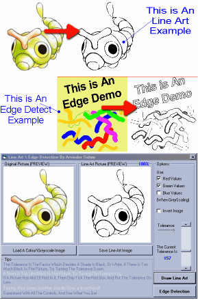

<div align="center">

## Line Art and Edge Detection


</div>

### Description

This App takes a colour image, and turns in into an black and white outline (see screenshot). This is useful for touching up scaned drawing or cartoon pictures. It was designed to help a teacher, that wants to scan pictures and get rid of the coulour, so that the kids could then colour it in.
 
### More Info
 
an image

an outine drawing of the image


<span>             |<span>
---                |---
**Submitted On**   |2000-09-23 12:39:14
**By**             |[Arvinder Sehmi](https://github.com/Planet-Source-Code/PSCIndex/blob/master/ByAuthor/arvinder-sehmi.md)
**Level**          |Advanced
**User Rating**    |4.9 (193 globes from 39 users)
**Compatibility**  |VB 5\.0, VB 6\.0
**Category**       |[Graphics](https://github.com/Planet-Source-Code/PSCIndex/blob/master/ByCategory/graphics__1-46.md)
**World**          |[Visual Basic](https://github.com/Planet-Source-Code/PSCIndex/blob/master/ByWorld/visual-basic.md)
**Archive File**   |[CODE\_UPLOAD100939232000\.zip](https://github.com/Planet-Source-Code/arvinder-sehmi-line-art-and-edge-detection__1-11631/archive/master.zip)

### API Declarations

```
Getpixel api
Setpixel api
```


